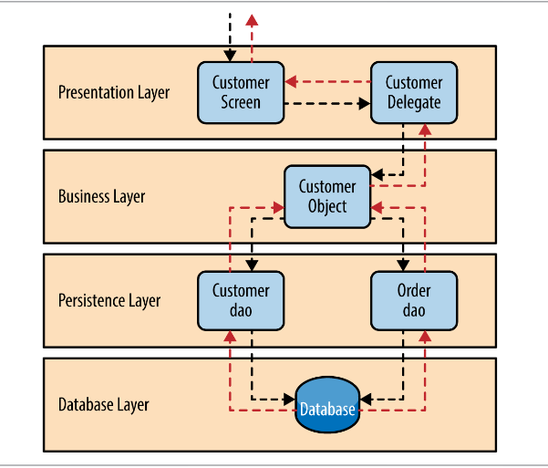

#Layering Pattern
Es gibt mehrere Stufen der "Einhaltung": wird das Schichtenmodell stark eingehalten, kann ein Layer nur mit der darüber liegenden und darunter liegenden Schichten kommunizieren. Lose gekoppelt kann eine höhere liegende Schicht mit mehreren darunter liegenden kommunizieren. 

Praktische Beispiele sind:
* grössere CRM-Systeme
* das OSI-Layer-Modell
* Client-Server-Applikationen (idR 3 Schichten Architektur)

##Intent
Bei Anpassungen an Klassen ist nur die jeweilige Schicht (Layer) und die anliegenden Schichten betroffen im Gegensatz zur ganzen Applikation.

##Applicability
* Grössere Software-Projekte
* Wenn mehrere Programmier-Teams zusammen arbeiten
* Load-Balanced applications 
* Multi-Server-Anwendungen

##Consequences
###Pro
* Layer können ausgetauscht werden.
* Testbarkeit (Layer können einzeln getestet werden)
* Layer können verteilt werden (Server, Anwendungen)
* Layer können einzeln angepasst und aktualisiert werden
* Security durch einzelne Layer höher 

###Contra
* Schlechtere Performance, da Abfragen alle Layer passieren.
  * Performance kann auch verbessert werden indem Layer übersprungen werden.
* Unter Umständen unnötig höhere Komplexität durch ähnliche Klassen über mehrere Layer (z. B. Security)
* Fehlerquellen erhöhen sich mit zunahme an Komponenten.
* Je nach Einsatzgebiet werden mehr Klassen benötigt als bei anderen Patterns.

##Praktische Beispiele
###Osi Modell

##Diagramm

