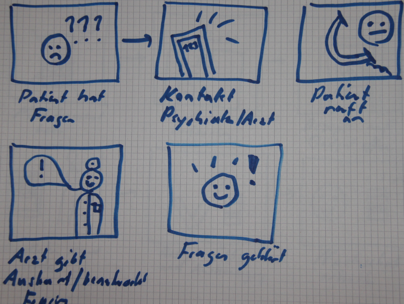
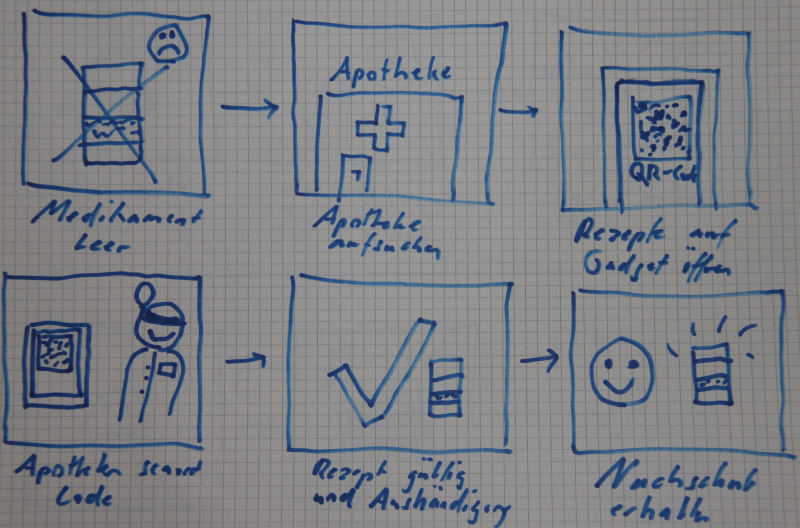
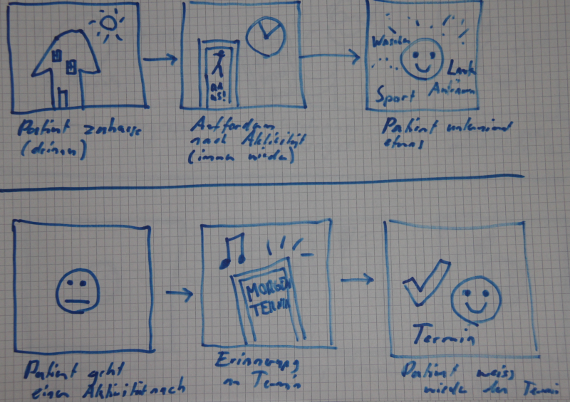
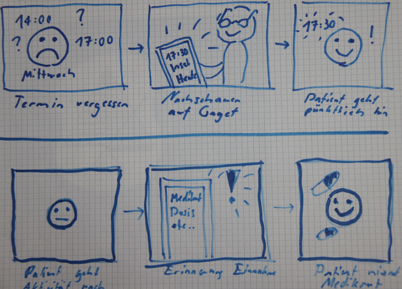

#Dokumentation Desgin Thinking

#Iteration1

##1. Scoping
@Loosli: einfüllen
define: project scope, out of scope, and success measures
##2. Research
investigate: literature, case studies, state of the art systems, …
conduct: one interview and/or field study

###Interview
Wir haben ein Konezpt für ein Interview erarbeitet. Die Fragen sollten aber nur die Grundstruktur des Interviews festlegen. 
[Download Interview Fragen](Interview Fragen.md)

**Interview mit Anna V.(Name geändert)**
Wir hatten ein spannendes Interview mit Anna V. 
Die strukturierte Auswertung des Interview befindet sich im Repository.
[Auswertung Interview](auswertung Inverview.md)

##3. Synthesize
collect, order, and analyze all material in your group
define: 2 or more personas as target user(s) for your application
define: main features (i.e., user requirements)
###Personas
Aufgrund der Interviewauswertungen haben wir folgende Personas angefertigt.

####Persona "Heinz"
* Arbeitslos / lebt seit 7 Jahren vom Sozialamt
* Alkoholsüchtig; Die Sucht bestimmt sein Leben; Nahrungsaufnahme und restliches wird dann zur Nebensache
* Alter: 47
* lebt allein in 2-Zimmerwohung
* Schläft bis Mittags, bleibt dafür aber bis früh morgens wach
* Tätigkeiten: Fernsehen, PC Spiele, verlässt selten das Haus
* Sein Freundeskreis beschränkt sich auf 3 Personen, welche ebenfalls ein Alkoholsuchtproblem aufweisen
* Verpasst Termine für ärztliche Behandlung, beim RAV
* hat generell Mühe gesellschaftliche Verpflichtungen wahrzunehmen (Rechnungen bezahlen, Briefkasten leeren, Termine einhalten, sich an Abmachungen halten,ect )
* Ist verschuldet, Wohnung ist schmutzig und chaotsch
* hat bereits 7x einen Entzug à 3 Wochen durchgefüht, ist aber immer wieder rückfällig geworden.

####Persona "Ingrit"
* Arbeitet 40% bei einem Sozialhilfeprogramm
* Methadonabhängig
* Ist in einem Methadonprogramm (2x pro Tag besucht sie die Methadonabgabestelle)
* lebt allein in 2-Zimmerwohung; häufiger Beziehungswechsel
* Arbeitet an 4 Tagen morgens
* Sie hat Mühe mit gesellschaftlichen Verpflichtungen
* Nimmt aber die meisten Termine wahr
* Die "aufsuchende Pflege" unterstützt sie bei den Administrativen Dingen (z.B. Rechnungen bezahlen, Wohnung aufräumen)
* Ihr letzter Entzug liegt 2 Jahre zurück
* Alter: 35
* die meisten Ihrer Freunde haben Suchtprobleme
* Sie schämt sich für ihre Sucht und meidet deshalb Personen aus dem "Nicht-Drogen-Millieu"
* Ihr Leben ist teilweise strukturiert, sie möchte aber selbstständiger werden

###Main features

**Generell**
* Gute Navigationsstruktur, um alle Bereiche zu erreichen

**Appointment**
* An Termine erinnern
* Terminübersicht anzeigen

**Treatment**
* Notfallnumern anzeigen
* Notfallplan anzeigen
* Behandlung soll Struktur in den Alltag des Patienten bringen
* Behandlung soll den Patienten zum Mitmachen animieren
* An Behandlung/ Aufgaben erinnern
* persönliche wichtigste Kontakte anzeigen
* Notfallbutton für aussenstehende Personen

**Medication**
* An Einnahme der Medimamente erinnern
* Medikation der Medikamente anzeigen
* Medikation der Notfall-Medikamente anzeigen

##4. Design
design storyboards
at least 2 storyboards per team member
discuss and iterate
make sure your storyboards are detailed enough to show the usage of a real system

### Storyboards

##5. Prototype
build cardboard-based prototypes for your most promising storyboards

##6. Validate
test your storyboards/prototypes with friends or family (i.e., outside this class)
first define your evaluation questions
then how you will find the answer

#Iteration2

##1. Scoping

###Out of Scope
* Rezeptverwaltung
* digitales Rezept mit QR-Code
Das System würde dadurch nur unnötig komplizierter (sowohl für die Entwickler, als auch für die Patienten, Apotheken, ect). Zudem werden die Rezepte bei Suchtpatienten kaum verloren und ein Trend des Medikamentenmissbrauchs ist nicht festzustellen. Quelle: [Interview mit Anna V.](auswertung Inverview.md).

##2. Research
investigate: literature, case studies, state of the art systems, …
conduct: one interview and/or field study
##3. Synthesize
collect, order, and analyze all material in your group
define: 2 or more personas as target user(s) for your application
define: main features (i.e., user requirements)
##4. Design
design storyboards
at least 2 storyboards per team member
discuss and iterate
make sure your storyboards are detailed enough to show the usage of a real system

##5. Prototype
build cardboard-based prototypes for your most promising storyboards

##6. Validate
test your storyboards/prototypes with friends or family (i.e., outside this class)
first define your evaluation questions
then how you will find the answer

#Iteration3

##1. Scoping
@Loosli: einfüllen
define: project scope, out of scope, and success measures
##2. Research
investigate: literature, case studies, state of the art systems, …
conduct: one interview and/or field study
##3. Synthesize
collect, order, and analyze all material in your group
define: 2 or more personas as target user(s) for your application
define: main features (i.e., user requirements)
##4. Design
design storyboards
at least 2 storyboards per team member
discuss and iterate
make sure your storyboards are detailed enough to show the usage of a real system

##5. Prototype
build cardboard-based prototypes for your most promising storyboards

##6. Validate
test your storyboards/prototypes with friends or family (i.e., outside this class)
first define your evaluation questions
then how you will find the answer
