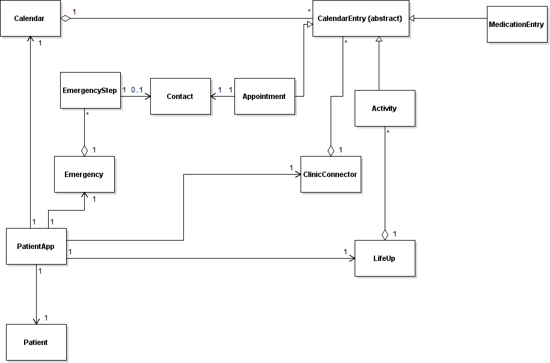
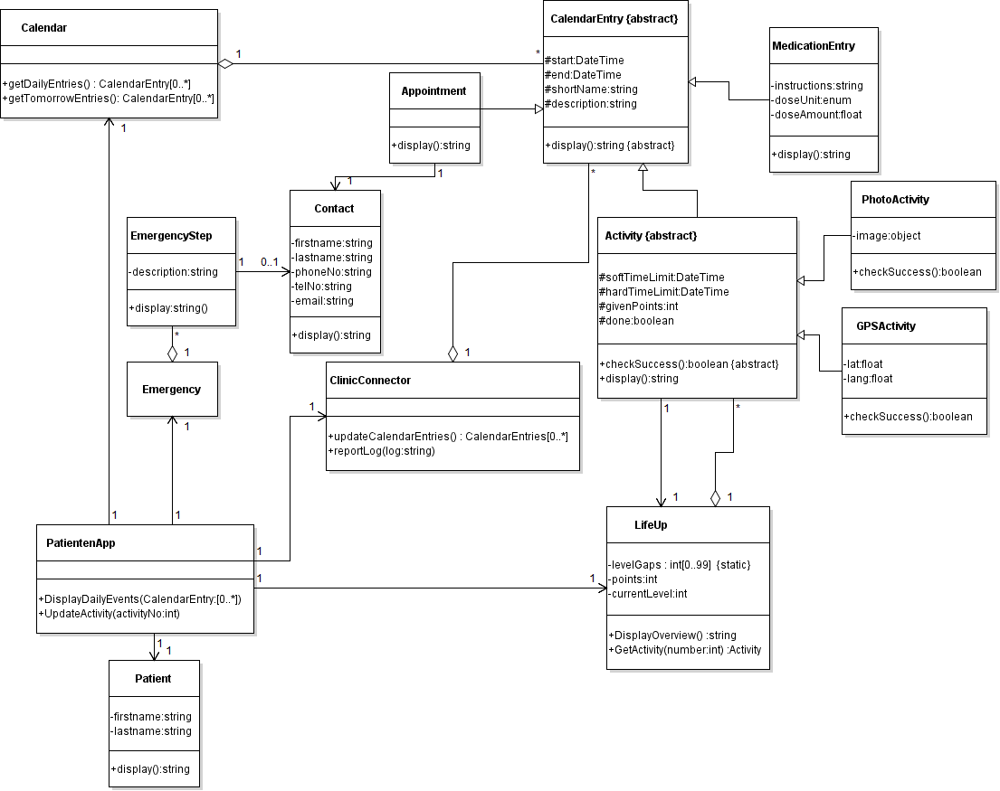

#Desgin

###Präsentation
[Präsentation](design.pptx)

##Domain Model Diagramm

##Sequenzdiagramme 

Der User erfüllt eine Aufgabe (Actitvity) im Spiel Life up: Er läuft z.B. zum Briefkasten und fotografiert ein Objekt.

Das System erinnert den User an alle, für diesen Tag, anstehenden Events (=Dinge, die der Patient zu erledigen hat)
z.B. 
* im LifeUp "einkaufen gehen"
* Medikamente einnehmen
* Termin beim Arzt wahrnehmen

##Class Diagramm
| Klasse| Verantwortlichkeit                             
| -------- | -------------------------------------- |
| PatientApp  | Bündelt die App, Schnittstelle für z.B. View / Controller| 
| Patient  | Personalien, Repräsentiert den Patienten| 
| Contact  | Repräsentiert einen kontakt z.B. Arzt oder Klinik|
| LifeUp  | Das Behandlungsspiel LifeUp, Verwaltet alle Activities direkt|
| ClinicConector  | Die Schnittstelle, welche die Kommunikation mit Fremdsystemen regelt|
| Emergency  | Beinhaltet den Notfallplan|
| EmergencyStep  |Repräsentiert einen einzelnen Notfallplan-Schritt (z.B. jemanden Anrufen oder einen hilfreichen Text)|
| Calendar  |Verwaltet alle Calendarentires, Bietet Zugriff auf CalendarEntires|
| CalendarEntry  |Abstrakte Klasse CalendarEntry - Alle CalendarEntry-Klassen müssen davon erben|
| MedicationEntry  | Repräsentiert die Medikation (z.B. 3x 2 Tabletten einnehmen)|
| Appointment  |Ein Termin mit Rückrufkontakt|
| Activity  |Repräsentiert eine Aktivität des LifeUp-Behandlungssystem|
| GPSActivity  | Spezialaktivität mit GPS Messung (z.B. für Aktivität "ins Migros gehen")
| PhotoActivity  | Spezialaktivität für Foto-Aktivitäten z.B Briefkasten im Behandlungssystem LifeUp fotografieren|

