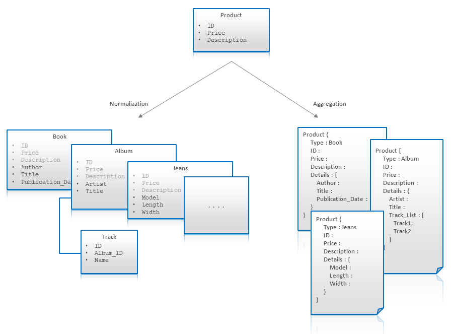
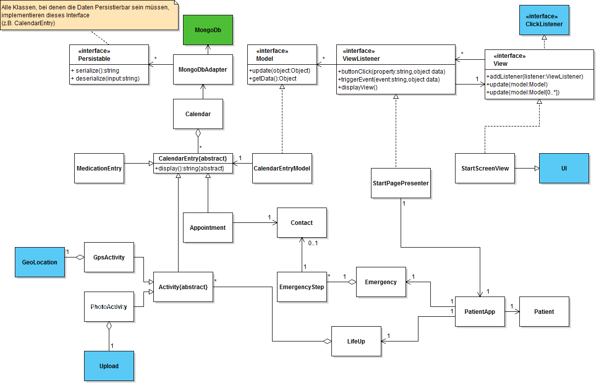

# Softwarearchitektur
## Vaadin Framework
Vaadin ist ein freies Java Web-Framework, gedacht um in Java sogenannte RIA (Rich Internet Application) zu bauen. Anders als z.B. bei JavaScript bietet Vaadin eine serverseitige Architektur, welche es ermöglicht den Grossteil der Programmlogik auf dem Server laufen zu lassen. Clientseitig baut Vaadin auf Googles Web Toolkit auf. Dieses wird zum Darstellen von Webseiten verwendet.

Vaadin bietet eine grosse Auswahl an UI-Komponenten.

## Systemanforderungen
### Datenpersistenz

Die PatientApp benötigt lokale Daten, da eine Verbindung zum Klinikserver nicht immer möglich oder erwünscht ist. MongoDB ist eine einfache und perfomante Datenbanklösung. Es ist die am weitesten verbreitete NoSQL-Datenbank, verwendet also keine SQL Abfragen um Daten zu erstellen, erhalten oder manipulieren. Schematas der Daten können im Format JSON ("JavaScript Object Notation") abgelegt werden. JSON ist ein ebenfalls weit verbreitetes Textformat, um Informationen auszutauschen oder speichern. Der grosse Vorteil dabei ist, dass JSON-Strings in Objekte umgewandlet werden können und umgekehrt. 

Gerade durch das objekt-orientierte Konzept ermöglicht eine NoSql-Datenbank eine einfache Persistierung der Daten.
Beinahe gleiche Daten (z.B. Medication und Appointments) können in der selben Tabelle gespeichert werden wie das nachfolgende Bild zeigt. 

### GPS & Foto

Die zu entwickelnde Applikation benutzt für das System "LifeUp" in gewissen Fällen GPS-Koordinaten, um beispielsweise das Erreichen oder Besuchen eines bestimmten Ortes zu überprüfen. Das verwendete Vaadin-Framework übersetzt mithilfe des GWTKs das in Java geschrieben Progamm in eine Webapplikation. Während in der standard Androidentwicklungsumgebung GPS eine häufige und unterstüzte Komponente ist, kann das Vaadin-Framework eine solche Unterstützung nicht vollständig gewährleisten. Die HTML5 Funktion, welche Vaadin verwendet, nennt sich GPS.getIfSupported(). Falls das GPS auf dem Endgerät nicht benutzt werden kann, muss eine solche GPS-Funktionalität simuliert, respektive darauf reagiert werden, damit das LifeUp-Spiel keine Aktivitäten vorschreiben kann, die nicht überprüfbar sind. Das genaue Vorgehen für das Simulieren ist nocht ausstehend.

Ein ähnliches Problem existiert auch für die Foto-Komponente, die im Spiel verwendet werden soll. Vaadin hat keinen Zugriff auf solche Bauteile. Das Problem, das das Aufnehmen von Fotos nicht möglich ist, wird mit einem Workaround gelöst: Es können lokale Bilder, die sich auf dem Endgerät befinden, hochgeladen werden. Diese werden wie ein Foto behandelt. 
 
 
## Patterns
### MVC
Das Model-View-Controller Pattern ist eine weit verbreitete Struktur um Software zu implementieren. MVC bietet die Trennung der Daten, der Logik und der Visualisierung. Der Vorteil ist die Austauschbarkeit der einzelnen Komponenten. So müssen beispielsweise bei einer Applikationen die für verschiedene Plattformen erstellt werden soll, nur diejenigen Komponenten ausgetauscht werden, welche auf dem Zielsystem anders funktionieren.
#### Model
Das Model enthält die Daten der Applikation. Häufig wird es mithilfe des Observable-Pattern verwendet - es stellt hier das Subjekt dar (falls sich Daten ändern).
#### View
Die View oder Präsentationsschicht bereitet die Daten vom Model auf und visualisiert diese. Die implementierte Logik kennt sie, aber verarbeitet Events nicht weiter, da dies der Aufgabenbereich des Controllers ist. 
#### Controller
Der Controller nimmt Benutzerinteraktionen entgegegen und löst die entsprechenden Abläufe aus. Er ist das Bindeglied zwischen der View und dem Model. In manchen Implementationen verwendet er auch das Observable-Pattern um bei Änderungen der Daten direkt die View zu aktualisieren. 

### MVP
Das Model-View-Presenter Pattern ist eine Überarbeitung von MVC. Jede Schicht ist strenger abgekapselt und lediglich über den Presenter findet die Kommunikation statt. Anders als beim MVC verknüpft der Presenter nur über Schnittstellen das Model und die View. 
#### Model
Das Model kennt nur sich selber und stellt auch wie beim MVC die Datenschicht dar. 
#### View
Die View ist nur für die Visualisierung und die Aktionsein- und ausgänge verantwortlich. Auch sie kennt nur sich selber. 
#### Presenter
Der Presenter ist das Bindeglied zwischen Model und View und steuert die logischen Abläufe. Er stellt die Verknüpfung des Model und Views her.
### Vaadin MVP
**Unsere Architektur basiert auf dem MVP-Pattern.**

Das Architekturdiagramm ist bloss ein Snapshot für das Hauptmenü. 
Folgende Presenter, Views und Models werden ebenfalls implementiert:

### Implementation
Main View
- StartPagePresenter
- ViewController

- Life Up
	- Presenter
		- LifeUpPresenter
	- Views
		- ListAchievments
		- ListDailyActivities
		- ShowActivity
	- Models
		- LifeUpModel
		- ActivityModel
- Appointment
	- Presenter
		- Appointment
	- Views
		- ShowAppointment
		- ListAppointments
	- Model
		- CalendarEntryModel
- Medications
	- Presenter
		- ShowmedicationList
		- MedicationPresenter
	- Views
		- MedicationView
	- Model
		- MedicationModel
- Emergency
	- Presenter
		- EmergencyPresenter
	- Views
		- EmergencyView
	- Model
		- EmergergencyModel

## Softwarearchitektur
## Appendix
